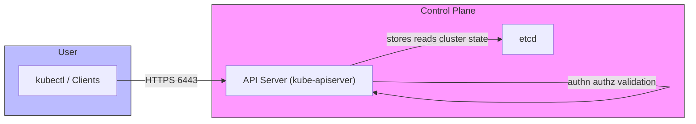
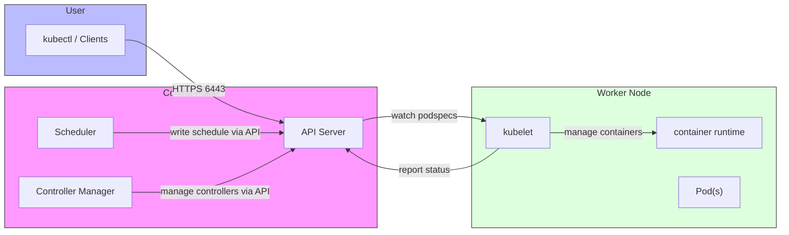

# Kubernetes quick reference and commands

lists of kubernetes commands and some basic reference notes

## Why containerize?

- Easy to create multiple instances
- Easy to tear down or replace
- Works the same always (consistent runtime environment)

## Why do we need an orchestrator like Kubernetes?

1. Containers are deployed on host machines — what if a host runs out of resources?
2. What if a container dies — who restarts it and handles recovery?
3. If a host machine goes down, all containers on it become unavailable — how do we reschedule them?

Kubernetes provides scheduling, self-healing, rolling updates, service discovery, and more to solve these problems.

## Kubernetes architecture (brief)

- Pods contain containers.
- Nodes (VMs or physical machines) run pods.
- Multiple nodes together form a cluster.
- Two node types: control-plane (controller) and worker nodes.

## Diagram: kubectl -> API Server -> etcd




ASCII fallback:

```
[kubectl / clients]
          |
          | HTTPS (6443)
          v
[kube-apiserver (control plane)] <----> [etcd (cluster datastore)]

kubectl talks to the API server over HTTPS. The API server persists cluster state in etcd.
```

## API Server — short explanation

- The kube-apiserver is the central management component of Kubernetes. It exposes the Kubernetes API (a RESTful interface) and is the front-end for the control plane.
- Responsibilities:
  - Serve the Kubernetes API (read/write objects like Pods, Services, Deployments).
  - Authenticate and authorize requests (RBAC, certificates, tokens).
  - Validate and admit objects (admission controllers apply policies).
  - Watch and notify other control-plane components of changes.
- Typical endpoint: HTTPS on port 6443. The apiserver is stateless — persistent state is stored in etcd.

## etcd — short explanation

- etcd is a consistent, highly-available key-value store used by Kubernetes to store all cluster state and configuration.
- Characteristics and notes:
  - Strong consistency (Raft consensus) so the cluster state is reliable.
  - Stores object manifests, cluster configuration, and small binary blobs — not intended for large files.
  - Requires careful backups and secure TLS configuration; losing etcd or having corrupted data can render the cluster unusable.
  - Typically run on control-plane nodes (often as a small cluster of 3 or 5 members for HA).

## Kubelet — short explanation

- The kubelet is the primary "node agent" that runs on every worker node.
- Responsibilities:
  - Registers the node with the API server and reports node status.
  - Watches the API server for PodSpecs assigned to its node and ensures the containers described in those PodSpecs are running via the container runtime (CRI).
  - Reports pod and container status back to the API server and serves pod-level logs/exec requests.
  - Exposes a local HTTPS endpoint (default port 10250) used by the control plane for node-level operations and status checks.
  - Enforces resource limits and interacts with cgroups on the node.

## Diagram: kubectl -> control plane -> worker node




ASCII fallback:

```
[kubectl / clients]
          |
          | HTTPS (6443)
          v
[Control Plane: API Server, Scheduler, Controller Manager]
          |
          | watches / assigns PodSpecs
          v
[Worker Node: kubelet] --> [container runtime] --> [Pods]

kubelet watches the API server for pods scheduled to its node, runs containers through the node's container runtime, and reports status back to the API server.
```

## Useful kubectl commands (quick cheat sheet)

List and inspect objects:

```bash
# cluster and node info
kubectl cluster-info
kubectl get nodes

# get resources
kubectl get pods
kubectl get pods -A            # all namespaces
kubectl get svc
kubectl get deployments
kubectl get namespaces

# describe and get details
kubectl describe pod <pod-name>
kubectl get pod <pod-name> -o wide
kubectl get pod <pod-name> -o yaml
```

Create, apply, delete resources:

```bash
kubectl apply -f my-resource.yaml
kubectl create namespace my-namespace
kubectl delete -f my-resource.yaml
kubectl delete pod <pod-name>
```

Debugging / logs / exec:

```bash
kubectl logs <pod-name>                 # logs of the first container
kubectl logs -c <container-name> <pod>  # specific container
kubectl exec -it <pod> -- /bin/sh      # run a shell in a pod -> linux access at pod level
kubectl port-forward svc/my-svc 8080:80
kubectl top pod                          # resource usage (requires metrics-server)
kubectl get events --sort-by=.metadata.creationTimestamp
```

```bash
kubectl port-forward <pod> source:desination # basically localmachine:containePort forwards the request
```
